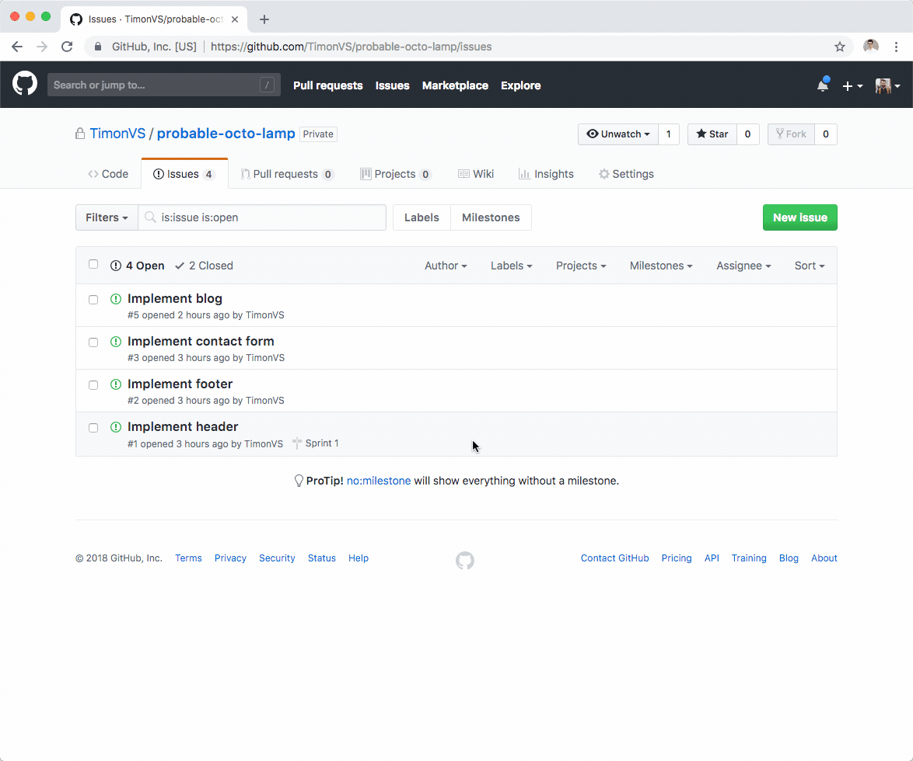

# Epic Generator

A GitHub bot that facilitates in creating epics.



## Usage

1. [Configure the GitHub App](https://github.com/apps/epic-generator), make sure to install it for select repositories and not for a whole organization.
2. Create a label with the name "epic".
3. Create or edit an issue and add any issues that are part of the epic by adding an HTML comment to the description of the issue like so: `<!-- EPIC:DATA #1 #5 -->`, add as many issues as you like.
4. Add the "epic" label to the issue
5. Submit the issue and refresh after a couple of seconds and the table should show up.

### Updating an epic

To add or remove issues from the epic simply edit the issue and add or remove issues between `<!-- EPIC:DATA` and `-->`.

## Caveats

When you close or otherwise update an issue that's part of an epic, the changes will not be reflected in the epic yet. Instead one has to update the epic (for example by adding a blank line) to make the table up-to-date.

## Development setup

```sh
# Install dependencies
yarn

# Run typescript
yarn build:watch

# Run the bot
yarn dev
```

## Contributing

If you have suggestions for how Epic Generator could be improved, or want to report a bug, open an issue! We'd love all and any contributions.

For more, check out the [Contributing Guide](CONTRIBUTING.md).

## License

[ISC](LICENSE) © 2018 Timon van Spronsen (http://timon.im)
